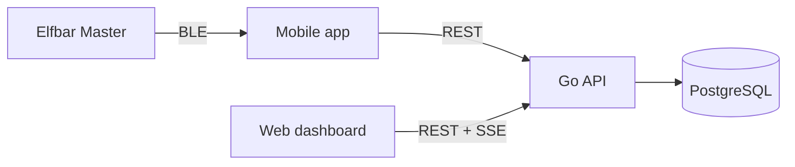

# Vapen

Vapen tracks the usage of an **Elfbar Master** e-cigarette. A mobile app reads puffs and device status over Bluetooth (like the vendor app InnoGate), sends them live to a self-hosted REST API, and a web dashboard visualizes them. Users can form groups to see who of their colleagues is vaping right now, limited by per-user privacy settings.

## Monorepo layout

| Folder | Component | Technology |
|---|---|---|
| [`api/`](api/) | REST API, auth, statistics, groups, privacy, live events | Go, PostgreSQL |
| [`mobile/`](mobile/) | Android app with background BLE tracking (iOS optional) | Flutter UI, native Kotlin service |
| [`web/`](web/) | Dashboard | SvelteKit 2, Svelte 5 |
| `deploy/`, `docker-compose.yml`, `.env.example` | Deployment (PostgreSQL, API, web, Caddy) | Docker Compose |



The API contract lives in [`api/openapi.yaml`](api/openapi.yaml); generated clients and server stubs should stay in sync with it.

## Quick start (once implemented)

```bash
cp .env.example .env
docker compose up -d postgres api          # API on http://localhost:8080
(cd api && go run ./cmd/seed)              # demo users alice@example.com / bob@example.com
docker compose up -d                       # incl. web (Coolify-ready; API also on :8080 for local dev)
docker compose --profile caddy up -d     # optional Caddy TLS in front of web (non-Coolify)
```
