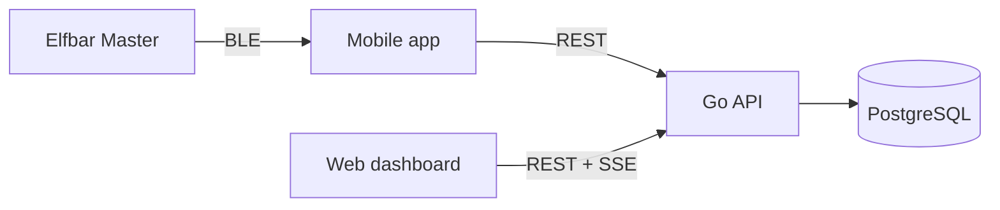

# Vapen

Vapen tracks the usage of an **Elfbar Master** e-cigarette. A mobile app reads puffs and device status over Bluetooth (like the vendor app InnoGate), sends them live to a self-hosted REST API, and a web dashboard visualizes them. Users can form groups to see who of their colleagues is vaping right now, limited by per-user privacy settings.

## Monorepo layout

| Folder | Component | Technology |
|---|---|---|
| [`api/`](api/) | REST API, auth, statistics, groups, privacy, live events | Go, PostgreSQL |
| [`mobile/`](mobile/) | Android app with background BLE tracking (iOS optional) | Flutter UI, native Kotlin service |
| [`web/`](web/) | Dashboard | SvelteKit 2, Svelte 5 |
| [`prompts/`](prompts/) | Implementation prompts for AI agents | Markdown |
| `deploy/`, `docker-compose.yml`, `.env.example` | Deployment (PostgreSQL, API, web, Caddy) | Docker Compose |



## Agent prompts

Each prompt is self-contained: it starts with an identical **Part A (Shared System Context & Contract)** describing architecture, data model, authentication, privacy rules and every API endpoint, followed by **Part B** with the component-specific specification.

- [`prompts/api.md`](prompts/api.md): Go REST API, database, deployment files
- [`prompts/mobile.md`](prompts/mobile.md): Flutter app, native Android background service, BLE reverse engineering of the Elfbar Master
- [`prompts/web.md`](prompts/web.md): SvelteKit dashboard

Once `api/openapi.yaml` exists, it is the single source of truth for the contract. Contract changes must update `api/openapi.yaml` and Part A in all three prompts together.

## Build order

1. **API first** (`prompts/api.md`, milestone 1): publishes the complete `api/openapi.yaml`, the compose setup and the seed and simulator tools.
2. **Web and mobile in parallel** afterwards. Both can work against the seeded API (`go run ./cmd/seed`, `go run ./cmd/simulate`) before the Bluetooth protocol is known.
3. **Mobile starts with reverse engineering** (milestone 1 in `prompts/mobile.md`): the Elfbar Master protocol is undocumented and must be decoded first; the agent reports the findings before implementing the protocol.

Example instruction for an agent: "Read `prompts/web.md` completely and implement it milestone by milestone."

## Quick start (once implemented)

```bash
cp .env.example .env
docker compose up -d postgres api          # API on http://localhost:8080
(cd api && go run ./cmd/seed)              # demo users alice@example.com / bob@example.com
docker compose --profile full up -d        # full stack incl. web and Caddy (TLS)
```
