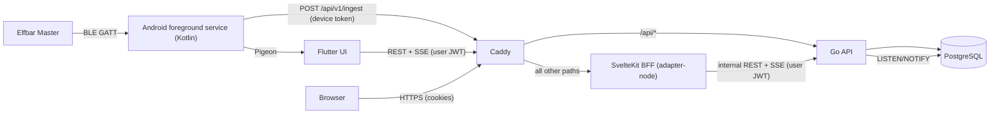
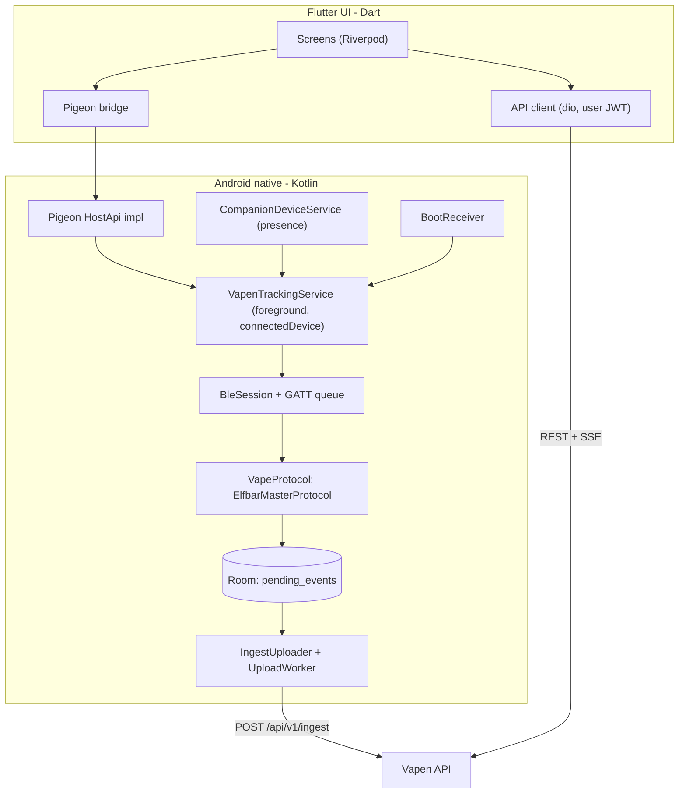

# Vapen: Mobile App (Flutter + native Android service)

## Role & Goal

You are a senior Android engineer (Kotlin, BLE, foreground services) with strong Flutter experience. Build the **Vapen mobile app** in the folder `mobile/` of this monorepo.

The app reads data from the user's **Elfbar Master** e-cigarette over Bluetooth Low Energy, exactly like the vendor app **InnoGate** does, and sends it **live** to the Vapen REST API. It must keep working as a **background service on Android** while the app UI is closed, after the app was swiped away and after a reboot. The app also provides login, device pairing, personal statistics, groups and privacy settings.

**Android is the primary platform and has 100 % priority in every decision.** iOS is optional: implement it only at the very end and only if it does not require any compromise on Android.

The BLE protocol of the Elfbar Master is **proprietary and undocumented**. Reverse engineering it is part of your job (Milestone 1). Part A below is the contract with the API and the web dashboard; Part B is your detailed specification.

<!-- BEGIN SHARED CONTEXT: keep this block byte-identical in prompts/api.md, prompts/mobile.md and prompts/web.md -->

## Part A: Shared System Context & Contract

> This part is identical in `prompts/api.md`, `prompts/mobile.md` and `prompts/web.md`. It gives every agent enough context about the other components to integrate cleanly. If you change anything in this contract, change it in all three prompt files **and** in `api/openapi.yaml` in the same commit.

### A.1 Product

**Vapen** tracks the usage of an **Elfbar Master** e-cigarette. The device talks Bluetooth Low Energy (BLE) and is normally used with the official vendor app **InnoGate**. Vapen replaces the read-out part of InnoGate with its own app, stores the data on a self-hosted server and visualizes it. Users can form **groups** (for example colleagues) to see who is vaping right now and how much, limited by per-user privacy settings.

| Component | Folder | Technology | Responsibility |
|---|---|---|---|
| Mobile app | `mobile/` | Flutter (UI) + native Kotlin Android foreground service (BLE, buffering, upload). iOS optional. | Connects to the Elfbar Master, decodes puffs and device status, streams them live to the API, also while the app UI is closed. Account, device, group and privacy UI. |
| REST API | `api/` | Go + PostgreSQL | Authentication, data ingest, storage, statistics, groups, privacy enforcement, live events (SSE). Owns the contract `api/openapi.yaml`. |
| Dashboard | `web/` | SvelteKit 2 + Svelte 5 (runes), TypeScript | Browser dashboard with charts for personal usage, device stats, groups and settings. Talks to the API server-side only (BFF pattern). |

Android is the primary platform and always has priority. iOS support is optional and must never degrade the Android implementation.

User-facing language in mobile and web: **German** (de-DE), with all strings centralized so they can be translated later. Code, comments, identifiers, commit messages and API field names: English.

### A.2 Architecture



Repository layout:

```text
vapen/
├── api/                  Go REST API; api/openapi.yaml is the contract source of truth
├── mobile/               Flutter app; mobile/android/ contains the native Kotlin service
├── web/                  SvelteKit dashboard
├── prompts/              Agent prompts (api.md, mobile.md, web.md)
├── deploy/Caddyfile      Reverse proxy config (automatic TLS)
├── docker-compose.yml    Services: postgres, api, web, caddy
├── .env.example          All environment variables with safe example values
└── README.md
```

Ownership: the API agent owns `api/`, `deploy/`, `docker-compose.yml` and `.env.example`. The web agent owns `web/` (including `web/Dockerfile`, which the compose service `web` builds). The mobile agent owns `mobile/`. Do not edit another component's folder; contract changes go through `api/openapi.yaml` (see A.3).

Networking:

- Production: one public origin, for example `https://vapen.example.com`. Caddy routes `/api/*` to `api:8080` (path unchanged) and everything else to `web:3000`.
- The web server calls the API via `API_INTERNAL_URL` (compose: `http://api:8080`). The browser never calls the API directly.
- The mobile app uses a configurable server base URL (for example `https://vapen.example.com`); all API paths below are relative to it.
- Android App Links: the web app serves `/.well-known/assetlinks.json` built from the environment variables `ANDROID_PACKAGE_NAME` (`dev.vapen.app`) and `ANDROID_CERT_SHA256_FINGERPRINTS` (comma-separated), so invite links (A.8) open the mobile app.
- Local development: `docker compose up -d postgres api` serves the API at `http://localhost:8080`. The web dev server runs at `http://localhost:5173` with `API_INTERNAL_URL=http://localhost:8080`. The Android emulator reaches the host at `http://10.0.2.2:8080`.
- Demo data: `go run ./cmd/seed` (in `api/`) creates the users `alice@example.com` and `bob@example.com` (password `vapen-demo-password`), one device each, 30 days of realistic puffs and status snapshots, and a shared group "Büro". `go run ./cmd/simulate --email alice@example.com` continuously sends live puffs through `POST /api/v1/ingest`. Web and mobile UI work can start against this data before the BLE protocol is decoded.

### A.3 Contract rules

- `api/openapi.yaml` (OpenAPI 3.1) is the single source of truth once it exists. Until then, this Part A is authoritative.
- Never silently invent endpoints or fields. If a consumer needs something that is missing, extend `api/openapi.yaml` and this Part A in all three prompt files in the same change, and keep it backwards compatible within `/api/v1`.
- Web generates TypeScript types from `api/openapi.yaml`; mobile generates Dart models from it. Regenerate after every contract change.

### A.4 Conventions

- Base path: `/api/v1`. Health checks `GET /healthz` (liveness) and `GET /readyz` (database reachable) are unauthenticated, live outside `/api/v1` and are only used inside the compose network.
- JSON everywhere, field names in `snake_case`. Unknown request fields are rejected with `400`.
- IDs: UUID strings (server generates UUIDv7). Clients generate `client_event_id` (see A.7).
- Timestamps: RFC 3339. Responses are always UTC with `Z`; requests may use any offset.
- Durations: integers in milliseconds with the suffix `_ms`.
- Time zones: IANA names (for example `Europe/Berlin`). Every user has a `timezone`; statistics endpoints accept a `tz` override. Bucket boundaries (day, week, month) are computed in that time zone and serialized as UTC. Weeks start on Monday (ISO 8601).
- Time ranges: `from` is inclusive, `to` is exclusive.
- Pagination: cursor based. Request `?limit=100&cursor=<opaque>`, response `{"items": [...], "next_cursor": "<opaque>" | null}`. `limit` max 500.
- Errors: RFC 9457 `application/problem+json`, always with a stable machine-readable `code`:

  ```json
  {"type": "https://vapen.dev/problems/validation-failed", "title": "Validation failed", "status": 400, "code": "validation_failed", "detail": "Request body is invalid", "errors": [{"field": "email", "message": "must be a valid email address"}]}
  ```

  Codes: `validation_failed`, `invalid_credentials`, `unauthorized`, `token_expired`, `forbidden`, `not_found`, `conflict`, `rate_limited`, `payload_too_large`, `internal`.
- Status codes: `200`/`201`/`204` success, `400` validation, `401` missing, invalid or expired token, `403` authenticated but not allowed, `404` unknown or not visible, `409` conflict, `413` payload too large, `429` rate limited (with `Retry-After` header).

### A.5 Authentication & sessions

- Users register and log in with email + password. Email is unique case-insensitively. Passwords: 12 to 128 characters, stored as argon2id hashes.
- Login errors are always generic (`invalid_credentials`); never reveal whether an email exists.
- All tokens are sent as `Authorization: Bearer <token>`.

| Token | Format | Lifetime | Used by | Allowed endpoints |
|---|---|---|---|---|
| Access token | JWT signed with EdDSA (Ed25519). Claims: `sub` (user id), `sid` (session id), `iat`, `exp`, `iss=vapen`, `aud=vapen-api` | 15 minutes | Web BFF server, Flutter UI | all `user` endpoints |
| Refresh token | Opaque: `vpr_` + 32 random bytes base64url. Server stores only the SHA-256 hash | 30 days, rotated on every use | Web BFF server, Flutter UI | `POST /auth/refresh` |
| Device ingest token | Opaque: `vpd_` + 32 random bytes base64url. Server stores only the SHA-256 hash. Plain value is shown once at creation | until revoked | Native Android service (and the optional iOS equivalent) | `POST /api/v1/ingest` only, only for its own device |

Refresh rotation: every `POST /auth/refresh` returns a new token pair and invalidates the presented refresh token. To tolerate parallel refreshes (for example two browser requests at the same moment), a just-rotated refresh token is accepted once more within a **grace period of 30 seconds** and then yields another new pair in the same session. Presenting a rotated token after the grace period is treated as token theft: the whole session is revoked and `401` is returned.

Sessions: every login or registration creates a session (`sid`). `POST /auth/logout` revokes the current session. Changing the password revokes all other sessions. Access tokens of a revoked session stay valid until they expire (at most 15 minutes); this is accepted.

Token storage per client:

- Web: the SvelteKit server keeps access and refresh token in `httpOnly`, `Secure`, `SameSite=Lax` cookies and refreshes server-side. Browser JavaScript never sees a token.
- Mobile UI: tokens in `flutter_secure_storage` (Android Keystore backed).
- Mobile background service: uses only the device ingest token, stored in Android Keystore-backed encrypted storage. It never touches user tokens. This avoids refresh races between UI and service and limits the damage if the token leaks.

### A.6 Domain model

Conceptual model; the API decides the exact SQL. Device fields marked `?` are nullable because the BLE protocol is not fully known yet.

- **User**: `id`, `email`, `display_name` (2 to 40 characters, visible to group members), `timezone`, `created_at`.
- **Device**: `id`, `user_id`, `model` (enum, currently only `elfbar_master`), `name` (user-editable), `hardware_id` (lowercase SHA-256 hex of the device serial number or, if none is available, of the BLE MAC address; unique per user), `firmware_version?`, `created_at`, `last_seen_at?`, `latest_status?` (DeviceStatus).
- **Puff** (one inhalation): `id`, `user_id`, `device_id`, `client_event_id`, `started_at`, `duration_ms` (1 to 60000), `source` (`live` = observed in real time, `history` = read from device memory later), `received_at`.
- **DeviceStatus** (snapshot): `recorded_at`, `battery_percent?` (0 to 100), `is_charging?`, `liquid_percent?` (0 to 100), `puff_counter_total?` (device-internal counter), `power_mode?` (string), `child_lock?`, `firmware_version?`.
- **Group**: `id`, `name` (1 to 60 characters), `owner_id`, `invite_code` (10 characters Crockford Base32, rotatable, only visible to owner and admins), `member_count`, `created_at`.
- **GroupMember**: `group_id`, `user_id`, `display_name`, `role` (`owner` | `admin` | `member`), `joined_at`. A user can be in many groups. Max 100 members per group.
- **PrivacySettings**: five boolean flags, see A.8.

Ingest events may carry the raw BLE payload as `raw` (`{"hex": "..."}`). The API stores it for debugging and never exposes it to other users.

### A.7 Ingest contract (`POST /api/v1/ingest`, device token)

Request:

```json
{
  "device_id": "01926b1e-7c1a-7a51-9d0e-6f1c2a3b4c5d",
  "sent_at": "2026-10-03T11:02:03.120Z",
  "events": [
    {"type": "puff_started", "client_event_id": "5b0e6c1a-...", "occurred_at": "2026-10-03T11:02:01.000Z"},
    {"type": "puff", "client_event_id": "8a1d0f2e-...", "started_at": "2026-10-03T11:02:01.000Z", "duration_ms": 2350, "source": "live", "raw": {"hex": "a5010c..."}},
    {"type": "status", "client_event_id": "c3e2a9b4-...", "recorded_at": "2026-10-03T11:02:03.000Z", "battery_percent": 76, "is_charging": false, "liquid_percent": 40, "puff_counter_total": 1234, "power_mode": "normal", "child_lock": false, "firmware_version": "1.2.3"}
  ]
}
```

Response `200`:

```json
{"accepted": 2, "duplicates": 1, "rejected": [{"client_event_id": "...", "code": "validation_failed", "message": "duration_ms out of range"}]}
```

Rules:

- `device_id` must match the device of the token, otherwise `403`.
- Max 500 events and 1 MiB per request. Events are processed independently; one invalid event never fails the batch. Only malformed JSON, auth errors or size limits fail the whole request.
- Idempotent: `(device_id, client_event_id)` is unique. Re-sent events are counted as `duplicates` and not stored twice. Clients delete buffered events once they are `accepted` or `duplicates`; `rejected` events must not be retried automatically.
- `client_event_id` is a UUID. For `puff` and `status` events it must be **deterministic** (UUIDv5 over stable inputs such as `hardware_id` plus device puff index or device timestamp), so the same puff read live and later again from device history deduplicates.
- `puff_started` is transient: it only updates live presence (A.9), is not stored as a puff and is ignored if `occurred_at` is older than 30 seconds. Not every protocol may provide it; everything must work without it.
- Timestamps more than 5 minutes in the future are rejected. Clients use the phone clock.
- `status` events update `latest_status` and `last_seen_at` of the device. The API may thin out stored snapshots to at most one per device per minute.
- Rate limit: 120 requests per minute per device token.

### A.8 Groups & privacy

Every user has **privacy defaults** and can **override** each flag per group (`null` = inherit the default). Effective value = override if set, otherwise default.

| Flag | Default | What other group members can see when `true` |
|---|---|---|
| `share_live_status` | `true` | Live status (vaping, active, idle) and `last_puff_at` |
| `share_usage_summary` | `true` | Aggregated totals and daily series (puff count, total duration) |
| `share_usage_detail` | `false` | Individual puffs with timestamps and durations, full usage statistics; allows other members to call `/puffs` and `/stats/usage` with `user_id` |
| `share_device_stats` | `false` | Device model, battery, liquid level, charging state; allows `/stats/devices/{id}` |
| `show_in_leaderboard` | `true` | Appears in group rankings (only effective together with `share_usage_summary`) |

Enforcement by the API, server-side, without exceptions:

- A user always sees all of their own data.
- Viewer V may see capability C of target user T only if V and T share at least one group in which T's effective flag C is `true`. For group-scoped endpoints (`/groups/{id}/...`) only the settings of that group count.
- Hidden data is omitted. In group overviews the section is `null` and a `visibility` object tells the client which sections are shared. Detail endpoints (`/puffs`, `/stats/usage`, `/stats/devices/{id}` for another user's data) answer `404` if not visible, so existence is not leaked.
- Group membership itself (display name, role) is visible to all members of that group.

Group lifecycle: any user can create groups and becomes `owner`. Others join via invite code or invite link `https://<origin>/join/<invite_code>` (handled by the web route `/join/[code]` and by Android App Links in the mobile app; QR codes encode this link). Owner and admins can rotate the invite code and remove members; only the owner can promote or demote admins, transfer ownership and delete the group. The owner cannot leave without transferring ownership first. Admins cannot remove the owner or other admins.

### A.9 Live presence (SSE)

`GET /api/v1/groups/{id}/live` returns `text/event-stream` (user access token; the web BFF proxies it). Only members whose effective `share_live_status` is `true` in this group are included.

```text
event: snapshot
data: {"members":[{"user_id":"...","display_name":"Alice","vaping_since":null,"last_puff_at":"2026-10-03T11:02:03Z","last_puff_duration_ms":2350}]}

event: member_update
data: {"user_id":"...","display_name":"Alice","vaping_since":"2026-10-03T11:05:00Z","last_puff_at":"2026-10-03T11:02:03Z","last_puff_duration_ms":2350}

event: member_removed
data: {"user_id":"..."}

: ping
```

- The first event is always `snapshot`. Then `member_update` on every `puff_started`, `puff`, or when a member starts sharing; `member_removed` when a member leaves or stops sharing live status. A `: ping` comment is sent every 15 seconds. Clients reconnect with exponential backoff and receive a fresh snapshot.
- The server sets `vaping_since` on `puff_started` and clears it when the following `puff` arrives.
- Status is derived by clients with these rules and re-evaluated every few seconds:
  - `vaping`: `vaping_since` is set and less than 15 seconds old.
  - `active`: `last_puff_at` is less than 5 minutes old.
  - `idle`: otherwise.
- Fan-out: ingest calls `pg_notify('vapen_live', ...)`, every API instance listens and forwards to its SSE subscribers.

### A.10 Endpoint catalog (`/api/v1`)

Auth column: `public` = no token, `user` = access token, `device` = device ingest token, `member` / `admin` / `owner` = access token plus group role.

Auth & account:

| Method & path | Auth | Purpose |
|---|---|---|
| `POST /auth/register` | public | `{email, password, display_name, timezone}` → `201 TokenPair` |
| `POST /auth/login` | public | `{email, password}` → `200 TokenPair` |
| `POST /auth/refresh` | public | `{refresh_token}` → `200 TokenPair` |
| `POST /auth/logout` | user | Revoke current session → `204` |
| `GET /me` | user | Current `User` |
| `PATCH /me` | user | `{display_name?, timezone?}` → `User` |
| `POST /me/password` | user | `{current_password, new_password}` → `204`; revokes all other sessions |
| `DELETE /me` | user | `{password}` → `204`; hard-deletes the user and all their data, removes them from groups (groups they own are deleted) |
| `GET /me/export` | user | JSON export of all own data (GDPR) |
| `GET /me/privacy-defaults` | user | `PrivacySettings` |
| `PUT /me/privacy-defaults` | user | `PrivacySettings` → `PrivacySettings` |

`TokenPair`: `{"access_token", "access_token_expires_at", "refresh_token", "refresh_token_expires_at", "user": User}`.

`PrivacySettings`: `{"share_live_status": true, "share_usage_summary": true, "share_usage_detail": false, "share_device_stats": false, "show_in_leaderboard": true}`.

Devices:

| Method & path | Auth | Purpose |
|---|---|---|
| `GET /devices` | user | Own devices including `latest_status` |
| `POST /devices` | user | `{model, name, hardware_id, firmware_version?}` → `201 Device`. If the `hardware_id` is already registered for this user: `200` with the existing device (idempotent) |
| `GET /devices/{id}` | user | Own device |
| `PATCH /devices/{id}` | user | `{name}` → `Device` |
| `DELETE /devices/{id}` | user | Delete device and all its data, revoke its tokens → `204` |
| `GET /devices/{id}/ingest-tokens` | user | `[{id, name, created_at, last_used_at, revoked_at}]` |
| `POST /devices/{id}/ingest-tokens` | user | `{name}` → `201 {id, name, token, created_at}`; `token` is returned only here |
| `DELETE /devices/{id}/ingest-tokens/{token_id}` | user | Revoke → `204` |

Ingest:

| Method & path | Auth | Purpose |
|---|---|---|
| `POST /ingest` | device | Batch of `puff_started`, `puff`, `status` events, see A.7 |

Read & statistics:

| Method & path | Auth | Purpose |
|---|---|---|
| `GET /puffs` | user | Individual puffs. Query: `from` (default now minus 24 h), `to` (default now), `user_id` (default self; others need `share_usage_detail`), `device_id`, `source`, `min_duration_ms`, `max_duration_ms`, `order` (`desc` default, `asc`), `limit` (default 100), `cursor` → `{items: [Puff], next_cursor}` |
| `GET /stats/usage` | user | Vaping behavior over time. Query: `from` (default start of the day 6 days ago in `tz`), `to` (default now), `bucket` (`hour`, `day`, `week`, `month`; default `day`), `tz` (default user time zone), `user_id` (default self; others need `share_usage_detail`), `device_id` → `UsageStats` |
| `GET /stats/devices/{id}` | user | Device statistics. Query: `from` (default now minus 7 days), `to` (default now), `bucket` (`hour`, `day`; default `hour`), `tz`. Own devices, or other members' devices with `share_device_stats` → `DeviceStats` |

`UsageStats` (series are gap-filled with zero buckets; `previous_period` covers the same length directly before `from`; `heatmap` covers the whole range, `iso_weekday` 1 = Monday, `hour` 0 to 23 in `tz`):

```json
{
  "user_id": "...", "device_id": null,
  "from": "2026-09-26T22:00:00Z", "to": "2026-10-03T11:00:00Z", "bucket": "day", "tz": "Europe/Berlin",
  "totals": {"puff_count": 312, "total_duration_ms": 701000, "avg_duration_ms": 2247, "max_duration_ms": 6100, "active_days": 7},
  "previous_period": {"puff_count": 290, "total_duration_ms": 650000},
  "series": [{"bucket_start": "2026-09-26T22:00:00Z", "puff_count": 40, "total_duration_ms": 90000, "avg_duration_ms": 2250, "max_duration_ms": 5000}],
  "heatmap": [{"iso_weekday": 1, "hour": 9, "puff_count": 12, "total_duration_ms": 26000}]
}
```

`DeviceStats` (series contain the last value per bucket; histogram bins are 500 ms wide up to 10 s, plus one overflow bin with `upper_ms: null`):

```json
{
  "device": {"id": "...", "model": "elfbar_master", "name": "Meine Elfbar", "last_seen_at": "..."},
  "from": "...", "to": "...", "bucket": "hour", "tz": "Europe/Berlin",
  "latest_status": {"recorded_at": "...", "battery_percent": 76, "is_charging": false, "liquid_percent": 40, "puff_counter_total": 1234, "power_mode": "normal", "child_lock": false, "firmware_version": "1.2.3"},
  "battery_series": [{"bucket_start": "...", "battery_percent": 76, "is_charging": false}],
  "liquid_series": [{"bucket_start": "...", "liquid_percent": 40}],
  "puff_duration": {"count": 312, "avg_ms": 2247, "median_ms": 2100, "p90_ms": 3900, "max_ms": 6100, "histogram": [{"lower_ms": 0, "upper_ms": 500, "count": 3}]},
  "puffs_since_last_charge": 87
}
```

Groups:

| Method & path | Auth | Purpose |
|---|---|---|
| `GET /groups` | user | My groups `[{id, name, role, member_count, created_at}]` |
| `POST /groups` | user | `{name}` → `201 Group` (caller is owner) |
| `GET /groups/{id}` | member | `Group` with `members: [GroupMember]`; `invite_code` only for owner and admins |
| `PATCH /groups/{id}` | admin | `{name}` → `Group` |
| `DELETE /groups/{id}` | owner | `204` |
| `POST /groups/join` | user | `{invite_code}` → `200 Group` (idempotent if already a member) |
| `POST /groups/{id}/invite/rotate` | admin | → `{invite_code}` |
| `POST /groups/{id}/leave` | member | `204`; owner gets `409` unless ownership was transferred |
| `PATCH /groups/{id}/members/{user_id}` | owner | `{role}` with `admin` or `member`; `owner` transfers ownership (previous owner becomes `admin`) |
| `DELETE /groups/{id}/members/{user_id}` | admin | Remove member → `204` |
| `GET /groups/{id}/privacy` | member | Caller's settings in this group: `{defaults: PrivacySettings, overrides: {flag: bool or null}, effective: PrivacySettings}` |
| `PUT /groups/{id}/privacy` | member | Body: `overrides` (every flag `true`, `false` or `null`) → same shape as GET |
| `GET /groups/{id}/overview` | member | Visible data of all members. Query: `from` (default start of today in `tz`), `to` (default now), `tz` → `GroupOverview` |
| `GET /groups/{id}/live` | member | SSE stream, see A.9 |

`GroupOverview` (`live`, `usage` and `device` are `null` when not shared; `usage.daily` uses local dates in `tz`; `leaderboard` is sorted by `total_duration_ms` descending and only contains members with effective `show_in_leaderboard` and `share_usage_summary`):

```json
{
  "group": {"id": "...", "name": "Büro", "member_count": 6},
  "from": "...", "to": "...", "tz": "Europe/Berlin",
  "members": [{
    "user_id": "...", "display_name": "Alice", "role": "member",
    "visibility": {"live_status": true, "usage_summary": true, "usage_detail": false, "device_stats": false, "leaderboard": true},
    "live": {"vaping_since": null, "last_puff_at": "2026-10-03T11:02:03Z", "last_puff_duration_ms": 2350},
    "usage": {"puff_count": 23, "total_duration_ms": 51000, "avg_duration_ms": 2217, "daily": [{"date": "2026-10-03", "puff_count": 23, "total_duration_ms": 51000}]},
    "device": null
  }],
  "leaderboard": [{"rank": 1, "user_id": "...", "display_name": "Alice", "puff_count": 23, "total_duration_ms": 51000}]
}
```

When shared, `device` is `{"model": "elfbar_master", "battery_percent": 76, "is_charging": false, "liquid_percent": 40, "last_seen_at": "..."}`.

<!-- END SHARED CONTEXT -->

## Part B: Mobile App Specification

### B.1 Core architecture decision: native Android core, Flutter UI

Everything that must run while the UI is closed is implemented **natively in Kotlin** inside `mobile/android/`:

- BLE scanning, connection, GATT operations and protocol decoding
- the Android foreground service
- the local event buffer (Room)
- the uploader to `POST /api/v1/ingest`

Flutter is used only for the UI (onboarding, login, pairing, dashboards, groups, privacy, settings, BLE Explorer). Flutter and Kotlin talk through **Pigeon**-generated, type-safe channels.

Why: a Flutter engine is not guaranteed to be alive when Android restarts the service (after reboot, process death, or a companion-device presence event). A Kotlin service has no dependency on a Dart isolate, survives UI death and is the most reliable option on Android. Do not move BLE or upload logic into Dart, and do not use Flutter BLE or background plugins (`flutter_blue_plus`, `flutter_background_service`, ...) for the tracking path.



### B.2 Tech stack

Check the latest stable versions when you start and use them.

- Flutter (latest stable), Dart 3, Material 3, `go_router`, `flutter_riverpod`, `dio`, `flutter_secure_storage`, `freezed` + `json_serializable`, `fl_chart` for charts, `mobile_scanner` (QR scan), `qr_flutter` (QR display), `share_plus`, `intl` for German formatting, `flutter_localizations` + ARB files (`de` only for now).
- API models: generate a Dart client package from `../api/openapi.yaml` with `openapi-generator` (`dart-dio` generator with `json_serializable`) into `mobile/packages/vapen_api/`. Add a script `mobile/tool/generate_api.sh` (and `.ps1`) to regenerate it. If the generator output is unusable for some endpoint (for example SSE), hand-write that part.
- Pigeon for Flutter/Kotlin bridging (definitions in `mobile/pigeons/`).
- Android: Kotlin (latest stable), coroutines + Flow, Room, WorkManager, OkHttp, kotlinx.serialization, AndroidX Security / Keystore-backed encrypted storage for the device token. `minSdk` 26, `targetSdk` and `compileSdk` latest stable.
- Tests: Kotlin JUnit 5 + Turbine + MockK, Robolectric where needed; Flutter `flutter_test` + `mocktail`.

### B.3 Project structure

```text
mobile/
├── lib/
│   ├── main.dart
│   ├── app/                  router, theme (light/dark), localization
│   ├── core/                 config (server URL), errors, formatting (durations in German)
│   ├── data/
│   │   ├── api/              dio setup, auth interceptor, SSE client, repositories
│   │   ├── auth/             token storage, session state
│   │   └── native/           Pigeon generated code + wrapper
│   └── features/
│       ├── onboarding/       server URL, login, register
│       ├── permissions/      permission and battery optimization wizard
│       ├── pairing/          companion device pairing, device registration
│       ├── home/             live status, today's stats, last puff, upload queue
│       ├── stats/            7/30-day charts from /stats/usage, device stats
│       ├── groups/           list, create, join (code, QR, link), detail with live view
│       ├── privacy/          defaults + per-group overrides
│       ├── settings/         account, devices, ingest tokens, tracking toggle, logs
│       └── ble_explorer/     reverse-engineering debug tool
├── pigeons/vapen_native.dart
├── packages/vapen_api/        generated API client
├── android/app/src/main/kotlin/dev/vapen/app/
│   ├── bridge/               Pigeon HostApi implementation, FlutterApi event forwarding
│   ├── service/              VapenTrackingService, notification, state machine
│   ├── companion/            CDM association, VapenCompanionDeviceService
│   ├── boot/                 BootReceiver
│   ├── ble/                  BleSession, GattOperationQueue, scanner, explorer
│   ├── protocol/             VapeProtocol, DeviceMessage, ElfbarMasterProtocol, SimulatedProtocol
│   ├── data/                 Room database, PendingEvent, CredentialStore
│   └── upload/               IngestUploader, UploadWorker, EventIdFactory (UUIDv5)
├── android/app/src/test/resources/ble-captures/   anonymized captures used as test fixtures
├── docs/
│   ├── reverse-engineering.md  how captures were made, step by step
│   └── elfbar-protocol.md      the decoded protocol (living document)
└── test/                      Flutter tests
```

### B.4 Milestone 1: reverse engineering the Elfbar Master protocol

The protocol is unknown. Proceed systematically and document every finding in `mobile/docs/elfbar-protocol.md` with sections: advertising data and device name pattern, GATT services and characteristics (UUIDs, properties), connection sequence (handshake, authentication, encryption, time sync), message framing (header, length, opcode, payload, checksum, endianness), command list, notification list, puff events, status fields, history download, open questions.

1. **BLE Explorer (build this first)**, a debug screen in the app backed by native Kotlin:
   - Scan with filters (name contains, RSSI), show advertising data (manufacturer data, service UUIDs, raw hex).
   - Connect, discover services, list all characteristics with properties, read readable ones, subscribe to all notify/indicate characteristics, write arbitrary hex to a characteristic.
   - Live log of every event: `{ts, direction (read, write, notify, indicate), service_uuid, char_uuid, hex, note}`. A text field adds manual **markers** into the log ("puff 3 s start", "battery shows 80 %").
   - Export the log as JSONL via the share sheet. Keep the Explorer reachable in release builds via a hidden developer switch in settings.
2. **Capture what InnoGate does** with the Android Bluetooth HCI snoop log. Write this procedure into `mobile/docs/reverse-engineering.md`:
   - Enable developer options, enable "Bluetooth HCI snoop log" (full), toggle Bluetooth off and on.
   - In InnoGate: pair/connect, wait, take 5 puffs with known durations (1 s, 2 s, 3 s, 5 s, 8 s, using a stopwatch), open every screen (battery, liquid, statistics, settings), change a setting, disconnect and reconnect (triggers history sync?).
   - Pull the log: `adb bugreport bugreport.zip`, extract `FS/data/misc/bluetooth/logs/btsnoop_hci.log` (path varies by vendor; some devices allow `adb pull /sdcard/btsnoop_hci.log`).
   - Analyze in Wireshark with filter `btatt`: list handles and UUIDs, writes from the phone (handshake, commands), notifications from the device, and correlate timestamps with the known puffs.
3. **Correlate and decode**: compare captures with the known actions. Identify the puff start/end notifications, how duration is encoded, battery and liquid fields, counters, device serial number, and whether there is a history download command.
4. **If the traffic is encrypted or needs a challenge-response handshake**: analyze the InnoGate APK (pull it from your own phone with `adb shell pm path` + `adb pull`, decompile with `jadx`, search for the UUID strings, `BluetoothGattCallback` implementations and crypto usage). This is decompilation for interoperability with the user's own device (permitted in the EU under Art. 6 of Directive 2009/24/EC). Do not redistribute InnoGate code or keys in the repo; document the algorithm in your own words and implement it independently.
5. **Fixtures**: save anonymized captures (no MAC addresses, no serial numbers) as JSONL in `android/app/src/test/resources/ble-captures/` and write decoder unit tests against them.
6. **Gate**: when Milestone 1 is done, stop and report the findings to the user (what is decoded, what is not, which device data fields are available). If the device exposes useful fields that are not in `DeviceStatus` (A.6), propose a contract change (A.3) instead of dropping them.

Practical constraints:

- The Elfbar Master probably accepts only **one BLE central at a time**. Force-stop InnoGate while Vapen is connected. Detect "connection refused or immediately dropped" and show a hint in German to close InnoGate.
- The device may require bonding; support both bonded and unbonded connections.
- Never write unknown commands to the device in production code. In the Explorer, writes are allowed but behind a confirmation dialog, because unknown commands could change device settings.

### B.5 Protocol abstraction

Keep the protocol replaceable and testable. Decoding is pure Kotlin without Android dependencies.

```kotlin
interface VapeProtocol {
    val model: String                       // "elfbar_master"
    fun matches(advertisement: Advertisement): Boolean
    suspend fun initialize(session: GattSession) // discovery, handshake, subscriptions, optional time sync
    fun decode(characteristic: UUID, value: ByteArray, receivedAt: Instant): List<DeviceMessage>
    suspend fun requestStatus(session: GattSession)
    suspend fun requestHistory(session: GattSession, sinceDeviceIndex: Long?) // no-op if unsupported
    fun hardwareId(info: DeviceInfo): String  // SHA-256 hex of serial number, fallback BLE MAC
}

sealed interface DeviceMessage {
    data class PuffStarted(val at: Instant) : DeviceMessage
    data class PuffCompleted(val startedAt: Instant, val durationMs: Int, val deviceIndex: Long?, val raw: ByteArray) : DeviceMessage
    data class HistoryPuff(val startedAt: Instant, val durationMs: Int, val deviceIndex: Long?, val raw: ByteArray) : DeviceMessage
    data class Status(val battery: Int?, val charging: Boolean?, val liquid: Int?, val counterTotal: Long?, val powerMode: String?, val childLock: Boolean?, val firmware: String?) : DeviceMessage
    data class Unknown(val characteristic: UUID, val raw: ByteArray) : DeviceMessage
}
```

- `ElfbarMasterProtocol` implements the decoded protocol.
- `SimulatedProtocol` plus a fake GATT session generates realistic puffs and status without hardware. Enable it via a developer setting ("Simuliertes Gerät"), so the whole pipeline (service, buffer, upload, UI) can be built and tested before Milestone 1 is finished.
- `EventIdFactory` creates deterministic UUIDv5 `client_event_id`s (A.7): namespace = fixed Vapen UUID, name = `hardware_id` + `deviceIndex` if available, otherwise `hardware_id` + `startedAt` in milliseconds rounded to 100 ms (or a device timestamp if the protocol provides one). Status events: `hardware_id` + `recorded_at` truncated to the minute. Document the exact rule in `elfbar-protocol.md`, because changing it later breaks deduplication.

### B.6 Background tracking on Android (no compromises)

Foreground service:

- `VapenTrackingService` with `android:foregroundServiceType="connectedDevice"`, started with `startForeground(..., FOREGROUND_SERVICE_TYPE_CONNECTED_DEVICE)`.
- Permanent, low-priority notification in German (channel "Tracking"): connection state, battery, today's puff count, pending uploads. Actions: "Pausieren", "App öffnen".
- `START_STICKY`; restore state from Room and the credential store on restart.

Staying alive and reconnecting:

- Pair through **CompanionDeviceManager** (association with a BLE device filter). This gives the app background start exemptions for foreground services and lets the system wake the app when the device comes into range. Implement a `CompanionDeviceService` and observe device presence (use the current recommended API for the target SDK, with fallbacks for older versions down to `minSdk`). On "device appeared", start the foreground service and connect. On "device disappeared", keep the service running in a low-power waiting state.
- Connect with `connectGatt(context, autoConnect = true, callback, TRANSPORT_LE)` so Android reconnects automatically without continuous scanning. Fall back to a short, filtered scan only when needed.
- `BootReceiver` (`BOOT_COMPLETED`, `MY_PACKAGE_REPLACED`) restarts tracking if it was enabled. Verify that starting a `connectedDevice` foreground service from `BOOT_COMPLETED` is allowed on the current Android version; if not, rely on the companion presence callback.
- Ask the user to exempt the app from battery optimization (`ACTION_REQUEST_IGNORE_BATTERY_OPTIMIZATIONS`, explain why first). Show OEM-specific hints (Samsung, Xiaomi, Huawei, OnePlus) with a link to dontkillmyapp.com.
- No permanent wake locks. Rely on BLE callbacks and the foreground service.

BLE session:

- One `GattOperationQueue` that serializes all GATT operations (Android allows only one outstanding operation), with timeouts and retries.
- State machine: `Idle → WaitingForDevice → Connecting → Discovering → Initializing → Live → (Disconnected → WaitingForDevice)`. Expose the state through Pigeon and in the notification.
- After `Initializing`: request MTU (for example 247), call `requestStatus`, then `requestHistory` since the last known device index (stored in Room), then switch to live notifications.
- Handle `GATT_ERROR 133` and similar errors: close the GATT object, back off exponentially (1 s up to 60 s), reconnect.

Permissions (`AndroidManifest.xml` and runtime flow):

- `BLUETOOTH_SCAN` (with `usesPermissionFlags="neverForLocation"`), `BLUETOOTH_CONNECT`; legacy `BLUETOOTH`, `BLUETOOTH_ADMIN` and `ACCESS_FINE_LOCATION` with `maxSdkVersion="30"`.
- `FOREGROUND_SERVICE`, `FOREGROUND_SERVICE_CONNECTED_DEVICE`, `POST_NOTIFICATIONS`, `RECEIVE_BOOT_COMPLETED`, `REQUEST_IGNORE_BATTERY_OPTIMIZATIONS`, `INTERNET`, `ACCESS_NETWORK_STATE`.
- Companion: `REQUEST_COMPANION_RUN_IN_BACKGROUND`, `REQUEST_COMPANION_START_FOREGROUND_SERVICES_FROM_BACKGROUND`, `REQUEST_OBSERVE_COMPANION_DEVICE_PRESENCE`, `uses-feature android.software.companion_device_setup`.
- A permission wizard in Flutter explains each permission in German before asking.

### B.7 Buffering and live upload

- Every decoded `PuffCompleted`, `HistoryPuff` and `Status` message is first written to the Room table `pending_events` (`client_event_id` primary key, `type`, `payload_json`, `created_at`, `attempts`, `last_error`). Nothing is ever sent without being persisted first.
- **Live path**: directly after insert, the uploader tries to send immediately (target: puff visible in the API within 2 seconds when online). Batches contain up to 500 events, oldest first.
- `PuffStarted` is sent immediately as `puff_started` and **not** buffered; drop it if it cannot be sent within 30 seconds (A.7).
- **Offline path**: on network failure or `5xx`, enqueue a unique `UploadWorker` (WorkManager, `NetworkType.CONNECTED`, exponential backoff). The service also retries when connectivity returns (`ConnectivityManager.NetworkCallback`).
- Response handling per A.7: delete `accepted` and `duplicates`; move `rejected` to a `dead_events` table (visible in the debug UI). `401`/`403`: stop uploading, keep events, show a notification "Bitte erneut anmelden", and let the Flutter UI create a new ingest token. `429`: honor `Retry-After`.
- Status events: send on change, at most once per minute, plus a heartbeat every 15 minutes while connected.
- Keep at most 30 days or 100,000 events in the buffer; drop the oldest beyond that and log it.

### B.8 Credentials and auth flow

- Flutter UI holds the user tokens (A.5) in `flutter_secure_storage`. A dio interceptor refreshes the access token with a single-flight lock (one refresh at a time; queued requests wait), retries the original request once, and logs out on refresh failure.
- After login and after pairing a device: `POST /devices` (idempotent via `hardware_id`), then `POST /devices/{id}/ingest-tokens` with name "Android <device model>", then pass `{baseUrl, deviceId, deviceToken, hardwareId}` to native via Pigeon `setCredentials`. The native side stores them in Keystore-backed encrypted storage. The Flutter side does not keep the device token.
- On logout: ask whether tracking should stop. If yes, revoke the ingest token (`DELETE /devices/{id}/ingest-tokens/{token_id}`) and call `clearCredentials`.
- The server base URL is configurable on the login screen (default from `--dart-define=VAPEN_BASE_URL=...`). Release builds require `https://`; debug builds allow `http://` for `10.0.2.2` and `localhost` only (network security config).

### B.9 Pigeon interface (sketch)

```dart
@HostApi()
abstract class TrackingHostApi {
  void setCredentials(NativeCredentials credentials);
  void clearCredentials();
  @async PairingResult associateDevice();       // CompanionDeviceManager flow
  void startTracking();
  void stopTracking();
  TrackingState getTrackingState();
  int getPendingEventCount();
  bool isIgnoringBatteryOptimizations();
  void requestIgnoreBatteryOptimizations();
  void setSimulationEnabled(bool enabled);
  // BLE Explorer
  void explorerStartScan(ExplorerScanFilter filter);
  void explorerStopScan();
  void explorerConnect(String address);
  void explorerDisconnect();
  void explorerWrite(String serviceUuid, String charUuid, String hex, bool withResponse);
  void explorerAddMarker(String note);
  String explorerExportLog();                   // returns file path for share sheet
}

@FlutterApi()
abstract class TrackingFlutterApi {
  void onTrackingStateChanged(TrackingState state);
  void onPuff(PuffInfo puff);
  void onStatus(StatusInfo status);
  void onExplorerEvent(ExplorerEvent event);
}
```

The `FlutterApi` callbacks are only delivered while a Flutter engine is attached; the service must not depend on them.

### B.10 Flutter UI

All UI text in German, Material 3, light and dark theme, readable durations ("2,3 s", "1 Min. 12 s").

- **Onboarding**: server URL, login, registration (display name, timezone preselected from the phone).
- **Permission wizard**: Bluetooth, notifications, battery optimization, OEM hints.
- **Pairing**: start the CDM association, then register the device and create the ingest token (B.8), then start tracking.
- **Home**: connection state (from native), battery and liquid, today's puff count and total seconds (`/stats/usage` for today plus live increments from `onPuff`), last puff, pending upload count, tracking toggle.
- **Statistics**: 7 and 30 days (bar chart of seconds per day, puff count line), hour-of-day heatmap, device stats (battery history, duration histogram) from `/stats/devices/{id}`.
- **Groups**: list, create, join via code, QR scan or App Link `https://<origin>/join/<code>` (Android App Links with `autoVerify`; the manifest host is static, so set it at build time via a Gradle property / `manifestPlaceholders`; `assetlinks.json` is served by the web app, see A.2; document the SHA-256 fingerprints of the debug and release signing certificates in `mobile/README.md`). Detail: live presence list from the SSE stream (A.9, with reconnect and the status rules), overview and leaderboard from `/groups/{id}/overview` (today, 7 days, 30 days), members with roles, invite QR and share for owner and admins, member management.
- **Privacy**: defaults and per-group overrides as tri-state (inherit, on, off) with a short German explanation per flag and a preview of what others see.
- **Settings**: account (display name, timezone, password change, export, delete account), devices and ingest tokens, server URL, developer switch (BLE Explorer, simulated device, dead events, export logs).

### B.11 Optional iOS (last milestone only)

Only after everything on Android is done and stable. Implement the same Pigeon `TrackingHostApi` in Swift:

- CoreBluetooth with `bluetooth-central` background mode and state preservation and restoration (`CBCentralManagerOptionRestoreIdentifierKey`), pending connection to the known peripheral.
- Local buffer (SQLite or Core Data) and upload with `URLSession`; the same deterministic event IDs.
- The protocol decoder ported to Swift with the same fixtures as tests.
- Accept iOS limitations (no guaranteed restart after the user force-quits the app). If iOS requires changing shared Dart or Android code in a way that weakens Android, do not do it; report to the user instead.

### B.12 Tests & quality gates

- Kotlin unit tests: protocol decoding against fixtures, `EventIdFactory`, GATT queue, state machine with a fake GATT session, uploader response handling (accepted, duplicates, rejected, 401, 429, offline), buffer limits.
- Flutter tests: auth interceptor (single-flight refresh), repositories with mocked dio, SSE parser and status rules, widget tests for home, groups and privacy.
- `flutter analyze` without warnings, `dart format` clean, `./gradlew lint` without errors.
- Manual test checklist in `mobile/docs/testing.md`, executed on a real device: app swiped away, phone rebooted, Doze (`adb shell dumpsys deviceidle force-idle`), App Standby, airplane mode for 1 hour then reconnect (no lost or duplicated puffs), device out of range and back, InnoGate running in parallel, battery drain over 8 hours (target: under 3 % per day from Vapen).
- CI: `.github/workflows/mobile.yml` on changes in `mobile/**`: analyze, Flutter tests, Gradle unit tests, debug APK build.

### B.13 Milestones

After each milestone, commit; everything builds and all tests pass.

0. **Setup**: Flutter project (`flutter create --org dev.vapen --project-name vapen --platforms android,ios mobile`), then set the Android `applicationId` and Kotlin package to `dev.vapen.app` (must match `ANDROID_PACKAGE_NAME`, A.2), Kotlin package structure, Pigeon bridge with stub implementations, generated API client, CI.
1. **Reverse engineering**: BLE Explorer, captures, `elfbar-protocol.md`, fixtures, decoder tests (B.4). Report to the user afterwards.
2. **Auth & API**: onboarding, login, registration, token handling, server URL. Can be built in parallel to Milestone 1 against the seeded API.
3. **Protocol**: `ElfbarMasterProtocol` and `SimulatedProtocol` behind `VapeProtocol`.
4. **Background tracking**: foreground service, CDM pairing and presence, boot receiver, Room buffer, live and offline upload, notification, permission wizard.
5. **UI**: home, statistics, groups with live SSE, privacy, settings.
6. **Hardening**: manual test checklist, battery measurements, error states, German texts reviewed.
7. **Optional iOS** (B.11).

### B.14 Assumptions, out of scope, open questions

- One Elfbar Master per user is the main case, but the data model supports several devices; the UI may show a device switcher.
- Out of scope: push notifications, controlling device settings (power mode, child lock) from Vapen, Play Store publishing.
- If the protocol cannot be decoded (for example strong encryption bound to an InnoGate cloud account), stop and report to the user with the findings and options instead of guessing.
- If something in Part A is contradictory or impossible, stop and ask the user instead of guessing.
