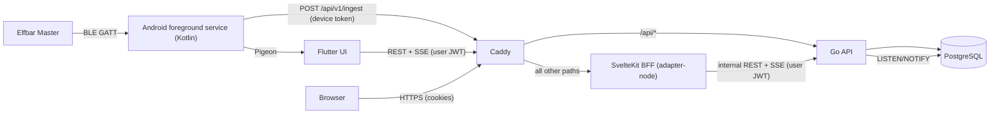

# Vapen: Web Dashboard (SvelteKit + Svelte 5)

## Role & Goal

You are a senior frontend engineer specialized in Svelte 5 and SvelteKit. Build the **Vapen web dashboard** in the folder `web/` of this monorepo.

The dashboard fetches data from the Vapen REST API and presents it in clear, attractive charts: personal vaping behavior, device statistics (battery, puff duration, ...), groups with a live view of who is vaping right now, and all account, device and privacy settings. Login must be secure: the browser never sees an API token (BFF pattern).

Part A below is the contract with the API and the mobile app; Part B is your detailed specification.

<!-- BEGIN SHARED CONTEXT: keep this block byte-identical in prompts/api.md, prompts/mobile.md and prompts/web.md -->

## Part A: Shared System Context & Contract

> This part is identical in `prompts/api.md`, `prompts/mobile.md` and `prompts/web.md`. It gives every agent enough context about the other components to integrate cleanly. If you change anything in this contract, change it in all three prompt files **and** in `api/openapi.yaml` in the same commit.

### A.1 Product

**Vapen** tracks the usage of an **Elfbar Master** e-cigarette. The device talks Bluetooth Low Energy (BLE) and is normally used with the official vendor app **InnoGate**. Vapen replaces the read-out part of InnoGate with its own app, stores the data on a self-hosted server and visualizes it. Users can form **groups** (for example colleagues) to see who is vaping right now and how much, limited by per-user privacy settings.

| Component | Folder | Technology | Responsibility |
|---|---|---|---|
| Mobile app | `mobile/` | Flutter (UI) + native Kotlin Android foreground service (BLE, buffering, upload). iOS optional. | Connects to the Elfbar Master, decodes puffs and device status, streams them live to the API, also while the app UI is closed. Account, device, group and privacy UI. |
| REST API | `api/` | Go + PostgreSQL | Authentication, data ingest, storage, statistics, groups, privacy enforcement, live events (SSE). Owns the contract `api/openapi.yaml`. |
| Dashboard | `web/` | SvelteKit 2 + Svelte 5 (runes), TypeScript | Browser dashboard with charts for personal usage, device stats, groups and settings. Talks to the API server-side only (BFF pattern). |

Android is the primary platform and always has priority. iOS support is optional and must never degrade the Android implementation.

User-facing language in mobile and web: **German** (de-DE), with all strings centralized so they can be translated later. Code, comments, identifiers, commit messages and API field names: English.

### A.2 Architecture



Repository layout:

```text
vapen/
├── api/                  Go REST API; api/openapi.yaml is the contract source of truth
├── mobile/               Flutter app; mobile/android/ contains the native Kotlin service
├── web/                  SvelteKit dashboard
├── prompts/              Agent prompts (api.md, mobile.md, web.md)
├── deploy/Caddyfile      Reverse proxy config (automatic TLS)
├── docker-compose.yml    Services: postgres, api, web, caddy
├── .env.example          All environment variables with safe example values
└── README.md
```

Ownership: the API agent owns `api/`, `deploy/`, `docker-compose.yml` and `.env.example`. The web agent owns `web/` (including `web/Dockerfile`, which the compose service `web` builds). The mobile agent owns `mobile/`. Do not edit another component's folder; contract changes go through `api/openapi.yaml` (see A.3).

Networking:

- Production: one public origin, for example `https://vapen.example.com`. Caddy routes `/api/*` to `api:8080` (path unchanged) and everything else to `web:3000`.
- The web server calls the API via `API_INTERNAL_URL` (compose: `http://api:8080`). The browser never calls the API directly.
- The mobile app uses a configurable server base URL (for example `https://vapen.example.com`); all API paths below are relative to it.
- Android App Links: the web app serves `/.well-known/assetlinks.json` built from the environment variables `ANDROID_PACKAGE_NAME` (`dev.vapen.app`) and `ANDROID_CERT_SHA256_FINGERPRINTS` (comma-separated), so invite links (A.8) open the mobile app.
- Local development: `docker compose up -d postgres api` serves the API at `http://localhost:8080`. The web dev server runs at `http://localhost:5173` with `API_INTERNAL_URL=http://localhost:8080`. The Android emulator reaches the host at `http://10.0.2.2:8080`.
- Demo data: `go run ./cmd/seed` (in `api/`) creates the users `alice@example.com` and `bob@example.com` (password `vapen-demo-password`), one device each, 30 days of realistic puffs and status snapshots, and a shared group "Büro". `go run ./cmd/simulate --email alice@example.com` continuously sends live puffs through `POST /api/v1/ingest`. Web and mobile UI work can start against this data before the BLE protocol is decoded.

### A.3 Contract rules

- `api/openapi.yaml` (OpenAPI 3.1) is the single source of truth once it exists. Until then, this Part A is authoritative.
- Never silently invent endpoints or fields. If a consumer needs something that is missing, extend `api/openapi.yaml` and this Part A in all three prompt files in the same change, and keep it backwards compatible within `/api/v1`.
- Web generates TypeScript types from `api/openapi.yaml`; mobile generates Dart models from it. Regenerate after every contract change.

### A.4 Conventions

- Base path: `/api/v1`. Health checks `GET /healthz` (liveness) and `GET /readyz` (database reachable) are unauthenticated, live outside `/api/v1` and are only used inside the compose network.
- JSON everywhere, field names in `snake_case`. Unknown request fields are rejected with `400`.
- IDs: UUID strings (server generates UUIDv7). Clients generate `client_event_id` (see A.7).
- Timestamps: RFC 3339. Responses are always UTC with `Z`; requests may use any offset.
- Durations: integers in milliseconds with the suffix `_ms`.
- Time zones: IANA names (for example `Europe/Berlin`). Every user has a `timezone`; statistics endpoints accept a `tz` override. Bucket boundaries (day, week, month) are computed in that time zone and serialized as UTC. Weeks start on Monday (ISO 8601).
- Time ranges: `from` is inclusive, `to` is exclusive.
- Pagination: cursor based. Request `?limit=100&cursor=<opaque>`, response `{"items": [...], "next_cursor": "<opaque>" | null}`. `limit` max 500.
- Errors: RFC 9457 `application/problem+json`, always with a stable machine-readable `code`:

  ```json
  {"type": "https://vapen.dev/problems/validation-failed", "title": "Validation failed", "status": 400, "code": "validation_failed", "detail": "Request body is invalid", "errors": [{"field": "email", "message": "must be a valid email address"}]}
  ```

  Codes: `validation_failed`, `invalid_credentials`, `unauthorized`, `token_expired`, `forbidden`, `not_found`, `conflict`, `rate_limited`, `payload_too_large`, `internal`.
- Status codes: `200`/`201`/`204` success, `400` validation, `401` missing, invalid or expired token, `403` authenticated but not allowed, `404` unknown or not visible, `409` conflict, `413` payload too large, `429` rate limited (with `Retry-After` header).

### A.5 Authentication & sessions

- Users register and log in with email + password. Email is unique case-insensitively. Passwords: 12 to 128 characters, stored as argon2id hashes.
- Login errors are always generic (`invalid_credentials`); never reveal whether an email exists.
- All tokens are sent as `Authorization: Bearer <token>`.

| Token | Format | Lifetime | Used by | Allowed endpoints |
|---|---|---|---|---|
| Access token | JWT signed with EdDSA (Ed25519). Claims: `sub` (user id), `sid` (session id), `iat`, `exp`, `iss=vapen`, `aud=vapen-api` | 15 minutes | Web BFF server, Flutter UI | all `user` endpoints |
| Refresh token | Opaque: `vpr_` + 32 random bytes base64url. Server stores only the SHA-256 hash | 30 days, rotated on every use | Web BFF server, Flutter UI | `POST /auth/refresh` |
| Device ingest token | Opaque: `vpd_` + 32 random bytes base64url. Server stores only the SHA-256 hash. Plain value is shown once at creation | until revoked | Native Android service (and the optional iOS equivalent) | `POST /api/v1/ingest` only, only for its own device |

Refresh rotation: every `POST /auth/refresh` returns a new token pair and invalidates the presented refresh token. To tolerate parallel refreshes (for example two browser requests at the same moment), a just-rotated refresh token is accepted once more within a **grace period of 30 seconds** and then yields another new pair in the same session. Presenting a rotated token after the grace period is treated as token theft: the whole session is revoked and `401` is returned.

Sessions: every login or registration creates a session (`sid`). `POST /auth/logout` revokes the current session. Changing the password revokes all other sessions. Access tokens of a revoked session stay valid until they expire (at most 15 minutes); this is accepted.

Token storage per client:

- Web: the SvelteKit server keeps access and refresh token in `httpOnly`, `Secure`, `SameSite=Lax` cookies and refreshes server-side. Browser JavaScript never sees a token.
- Mobile UI: tokens in `flutter_secure_storage` (Android Keystore backed).
- Mobile background service: uses only the device ingest token, stored in Android Keystore-backed encrypted storage. It never touches user tokens. This avoids refresh races between UI and service and limits the damage if the token leaks.

### A.6 Domain model

Conceptual model; the API decides the exact SQL. Device fields marked `?` are nullable because the BLE protocol is not fully known yet.

- **User**: `id`, `email`, `display_name` (2 to 40 characters, visible to group members), `timezone`, `created_at`.
- **Device**: `id`, `user_id`, `model` (enum, currently only `elfbar_master`), `name` (user-editable), `hardware_id` (lowercase SHA-256 hex of the device serial number or, if none is available, of the BLE MAC address; unique per user), `firmware_version?`, `created_at`, `last_seen_at?`, `latest_status?` (DeviceStatus).
- **Puff** (one inhalation): `id`, `user_id`, `device_id`, `client_event_id`, `started_at`, `duration_ms` (1 to 60000), `source` (`live` = observed in real time, `history` = read from device memory later), `received_at`.
- **DeviceStatus** (snapshot): `recorded_at`, `battery_percent?` (0 to 100), `is_charging?`, `liquid_percent?` (0 to 100), `puff_counter_total?` (device-internal counter), `power_mode?` (string), `child_lock?`, `firmware_version?`.
- **Group**: `id`, `name` (1 to 60 characters), `owner_id`, `invite_code` (10 characters Crockford Base32, rotatable, only visible to owner and admins), `member_count`, `created_at`.
- **GroupMember**: `group_id`, `user_id`, `display_name`, `role` (`owner` | `admin` | `member`), `joined_at`. A user can be in many groups. Max 100 members per group.
- **PrivacySettings**: five boolean flags, see A.8.

Ingest events may carry the raw BLE payload as `raw` (`{"hex": "..."}`). The API stores it for debugging and never exposes it to other users.

### A.7 Ingest contract (`POST /api/v1/ingest`, device token)

Request:

```json
{
  "device_id": "01926b1e-7c1a-7a51-9d0e-6f1c2a3b4c5d",
  "sent_at": "2026-10-03T11:02:03.120Z",
  "events": [
    {"type": "puff_started", "client_event_id": "5b0e6c1a-...", "occurred_at": "2026-10-03T11:02:01.000Z"},
    {"type": "puff", "client_event_id": "8a1d0f2e-...", "started_at": "2026-10-03T11:02:01.000Z", "duration_ms": 2350, "source": "live", "raw": {"hex": "a5010c..."}},
    {"type": "status", "client_event_id": "c3e2a9b4-...", "recorded_at": "2026-10-03T11:02:03.000Z", "battery_percent": 76, "is_charging": false, "liquid_percent": 40, "puff_counter_total": 1234, "power_mode": "normal", "child_lock": false, "firmware_version": "1.2.3"}
  ]
}
```

Response `200`:

```json
{"accepted": 2, "duplicates": 1, "rejected": [{"client_event_id": "...", "code": "validation_failed", "message": "duration_ms out of range"}]}
```

Rules:

- `device_id` must match the device of the token, otherwise `403`.
- Max 500 events and 1 MiB per request. Events are processed independently; one invalid event never fails the batch. Only malformed JSON, auth errors or size limits fail the whole request.
- Idempotent: `(device_id, client_event_id)` is unique. Re-sent events are counted as `duplicates` and not stored twice. Clients delete buffered events once they are `accepted` or `duplicates`; `rejected` events must not be retried automatically.
- `client_event_id` is a UUID. For `puff` and `status` events it must be **deterministic** (UUIDv5 over stable inputs such as `hardware_id` plus device puff index or device timestamp), so the same puff read live and later again from device history deduplicates.
- `puff_started` is transient: it only updates live presence (A.9), is not stored as a puff and is ignored if `occurred_at` is older than 30 seconds. Not every protocol may provide it; everything must work without it.
- Timestamps more than 5 minutes in the future are rejected. Clients use the phone clock.
- `status` events update `latest_status` and `last_seen_at` of the device. The API may thin out stored snapshots to at most one per device per minute.
- Rate limit: 120 requests per minute per device token.

### A.8 Groups & privacy

Every user has **privacy defaults** and can **override** each flag per group (`null` = inherit the default). Effective value = override if set, otherwise default.

| Flag | Default | What other group members can see when `true` |
|---|---|---|
| `share_live_status` | `true` | Live status (vaping, active, idle) and `last_puff_at` |
| `share_usage_summary` | `true` | Aggregated totals and daily series (puff count, total duration) |
| `share_usage_detail` | `false` | Individual puffs with timestamps and durations, full usage statistics; allows other members to call `/puffs` and `/stats/usage` with `user_id` |
| `share_device_stats` | `false` | Device model, battery, liquid level, charging state; allows `/stats/devices/{id}` |
| `show_in_leaderboard` | `true` | Appears in group rankings (only effective together with `share_usage_summary`) |

Enforcement by the API, server-side, without exceptions:

- A user always sees all of their own data.
- Viewer V may see capability C of target user T only if V and T share at least one group in which T's effective flag C is `true`. For group-scoped endpoints (`/groups/{id}/...`) only the settings of that group count.
- Hidden data is omitted. In group overviews the section is `null` and a `visibility` object tells the client which sections are shared. Detail endpoints (`/puffs`, `/stats/usage`, `/stats/devices/{id}` for another user's data) answer `404` if not visible, so existence is not leaked.
- Group membership itself (display name, role) is visible to all members of that group.

Group lifecycle: any user can create groups and becomes `owner`. Others join via invite code or invite link `https://<origin>/join/<invite_code>` (handled by the web route `/join/[code]` and by Android App Links in the mobile app; QR codes encode this link). Owner and admins can rotate the invite code and remove members; only the owner can promote or demote admins, transfer ownership and delete the group. The owner cannot leave without transferring ownership first. Admins cannot remove the owner or other admins.

### A.9 Live presence (SSE)

`GET /api/v1/groups/{id}/live` returns `text/event-stream` (user access token; the web BFF proxies it). Only members whose effective `share_live_status` is `true` in this group are included.

```text
event: snapshot
data: {"members":[{"user_id":"...","display_name":"Alice","vaping_since":null,"last_puff_at":"2026-10-03T11:02:03Z","last_puff_duration_ms":2350}]}

event: member_update
data: {"user_id":"...","display_name":"Alice","vaping_since":"2026-10-03T11:05:00Z","last_puff_at":"2026-10-03T11:02:03Z","last_puff_duration_ms":2350}

event: member_removed
data: {"user_id":"..."}

: ping
```

- The first event is always `snapshot`. Then `member_update` on every `puff_started`, `puff`, or when a member starts sharing; `member_removed` when a member leaves or stops sharing live status. A `: ping` comment is sent every 15 seconds. Clients reconnect with exponential backoff and receive a fresh snapshot.
- The server sets `vaping_since` on `puff_started` and clears it when the following `puff` arrives.
- Status is derived by clients with these rules and re-evaluated every few seconds:
  - `vaping`: `vaping_since` is set and less than 15 seconds old.
  - `active`: `last_puff_at` is less than 5 minutes old.
  - `idle`: otherwise.
- Fan-out: ingest calls `pg_notify('vapen_live', ...)`, every API instance listens and forwards to its SSE subscribers.

### A.10 Endpoint catalog (`/api/v1`)

Auth column: `public` = no token, `user` = access token, `device` = device ingest token, `member` / `admin` / `owner` = access token plus group role.

Auth & account:

| Method & path | Auth | Purpose |
|---|---|---|
| `POST /auth/register` | public | `{email, password, display_name, timezone}` → `201 TokenPair` |
| `POST /auth/login` | public | `{email, password}` → `200 TokenPair` |
| `POST /auth/refresh` | public | `{refresh_token}` → `200 TokenPair` |
| `POST /auth/logout` | user | Revoke current session → `204` |
| `GET /me` | user | Current `User` |
| `PATCH /me` | user | `{display_name?, timezone?}` → `User` |
| `POST /me/password` | user | `{current_password, new_password}` → `204`; revokes all other sessions |
| `DELETE /me` | user | `{password}` → `204`; hard-deletes the user and all their data, removes them from groups (groups they own are deleted) |
| `GET /me/export` | user | JSON export of all own data (GDPR) |
| `GET /me/privacy-defaults` | user | `PrivacySettings` |
| `PUT /me/privacy-defaults` | user | `PrivacySettings` → `PrivacySettings` |

`TokenPair`: `{"access_token", "access_token_expires_at", "refresh_token", "refresh_token_expires_at", "user": User}`.

`PrivacySettings`: `{"share_live_status": true, "share_usage_summary": true, "share_usage_detail": false, "share_device_stats": false, "show_in_leaderboard": true}`.

Devices:

| Method & path | Auth | Purpose |
|---|---|---|
| `GET /devices` | user | Own devices including `latest_status` |
| `POST /devices` | user | `{model, name, hardware_id, firmware_version?}` → `201 Device`. If the `hardware_id` is already registered for this user: `200` with the existing device (idempotent) |
| `GET /devices/{id}` | user | Own device |
| `PATCH /devices/{id}` | user | `{name}` → `Device` |
| `DELETE /devices/{id}` | user | Delete device and all its data, revoke its tokens → `204` |
| `GET /devices/{id}/ingest-tokens` | user | `[{id, name, created_at, last_used_at, revoked_at}]` |
| `POST /devices/{id}/ingest-tokens` | user | `{name}` → `201 {id, name, token, created_at}`; `token` is returned only here |
| `DELETE /devices/{id}/ingest-tokens/{token_id}` | user | Revoke → `204` |

Ingest:

| Method & path | Auth | Purpose |
|---|---|---|
| `POST /ingest` | device | Batch of `puff_started`, `puff`, `status` events, see A.7 |

Read & statistics:

| Method & path | Auth | Purpose |
|---|---|---|
| `GET /puffs` | user | Individual puffs. Query: `from` (default now minus 24 h), `to` (default now), `user_id` (default self; others need `share_usage_detail`), `device_id`, `source`, `min_duration_ms`, `max_duration_ms`, `order` (`desc` default, `asc`), `limit` (default 100), `cursor` → `{items: [Puff], next_cursor}` |
| `GET /stats/usage` | user | Vaping behavior over time. Query: `from` (default start of the day 6 days ago in `tz`), `to` (default now), `bucket` (`hour`, `day`, `week`, `month`; default `day`), `tz` (default user time zone), `user_id` (default self; others need `share_usage_detail`), `device_id` → `UsageStats` |
| `GET /stats/devices/{id}` | user | Device statistics. Query: `from` (default now minus 7 days), `to` (default now), `bucket` (`hour`, `day`; default `hour`), `tz`. Own devices, or other members' devices with `share_device_stats` → `DeviceStats` |

`UsageStats` (series are gap-filled with zero buckets; `previous_period` covers the same length directly before `from`; `heatmap` covers the whole range, `iso_weekday` 1 = Monday, `hour` 0 to 23 in `tz`):

```json
{
  "user_id": "...", "device_id": null,
  "from": "2026-09-26T22:00:00Z", "to": "2026-10-03T11:00:00Z", "bucket": "day", "tz": "Europe/Berlin",
  "totals": {"puff_count": 312, "total_duration_ms": 701000, "avg_duration_ms": 2247, "max_duration_ms": 6100, "active_days": 7},
  "previous_period": {"puff_count": 290, "total_duration_ms": 650000},
  "series": [{"bucket_start": "2026-09-26T22:00:00Z", "puff_count": 40, "total_duration_ms": 90000, "avg_duration_ms": 2250, "max_duration_ms": 5000}],
  "heatmap": [{"iso_weekday": 1, "hour": 9, "puff_count": 12, "total_duration_ms": 26000}]
}
```

`DeviceStats` (series contain the last value per bucket; histogram bins are 500 ms wide up to 10 s, plus one overflow bin with `upper_ms: null`):

```json
{
  "device": {"id": "...", "model": "elfbar_master", "name": "Meine Elfbar", "last_seen_at": "..."},
  "from": "...", "to": "...", "bucket": "hour", "tz": "Europe/Berlin",
  "latest_status": {"recorded_at": "...", "battery_percent": 76, "is_charging": false, "liquid_percent": 40, "puff_counter_total": 1234, "power_mode": "normal", "child_lock": false, "firmware_version": "1.2.3"},
  "battery_series": [{"bucket_start": "...", "battery_percent": 76, "is_charging": false}],
  "liquid_series": [{"bucket_start": "...", "liquid_percent": 40}],
  "puff_duration": {"count": 312, "avg_ms": 2247, "median_ms": 2100, "p90_ms": 3900, "max_ms": 6100, "histogram": [{"lower_ms": 0, "upper_ms": 500, "count": 3}]},
  "puffs_since_last_charge": 87
}
```

Groups:

| Method & path | Auth | Purpose |
|---|---|---|
| `GET /groups` | user | My groups `[{id, name, role, member_count, created_at}]` |
| `POST /groups` | user | `{name}` → `201 Group` (caller is owner) |
| `GET /groups/{id}` | member | `Group` with `members: [GroupMember]`; `invite_code` only for owner and admins |
| `PATCH /groups/{id}` | admin | `{name}` → `Group` |
| `DELETE /groups/{id}` | owner | `204` |
| `POST /groups/join` | user | `{invite_code}` → `200 Group` (idempotent if already a member) |
| `POST /groups/{id}/invite/rotate` | admin | → `{invite_code}` |
| `POST /groups/{id}/leave` | member | `204`; owner gets `409` unless ownership was transferred |
| `PATCH /groups/{id}/members/{user_id}` | owner | `{role}` with `admin` or `member`; `owner` transfers ownership (previous owner becomes `admin`) |
| `DELETE /groups/{id}/members/{user_id}` | admin | Remove member → `204` |
| `GET /groups/{id}/privacy` | member | Caller's settings in this group: `{defaults: PrivacySettings, overrides: {flag: bool or null}, effective: PrivacySettings}` |
| `PUT /groups/{id}/privacy` | member | Body: `overrides` (every flag `true`, `false` or `null`) → same shape as GET |
| `GET /groups/{id}/overview` | member | Visible data of all members. Query: `from` (default start of today in `tz`), `to` (default now), `tz` → `GroupOverview` |
| `GET /groups/{id}/live` | member | SSE stream, see A.9 |

`GroupOverview` (`live`, `usage` and `device` are `null` when not shared; `usage.daily` uses local dates in `tz`; `leaderboard` is sorted by `total_duration_ms` descending and only contains members with effective `show_in_leaderboard` and `share_usage_summary`):

```json
{
  "group": {"id": "...", "name": "Büro", "member_count": 6},
  "from": "...", "to": "...", "tz": "Europe/Berlin",
  "members": [{
    "user_id": "...", "display_name": "Alice", "role": "member",
    "visibility": {"live_status": true, "usage_summary": true, "usage_detail": false, "device_stats": false, "leaderboard": true},
    "live": {"vaping_since": null, "last_puff_at": "2026-10-03T11:02:03Z", "last_puff_duration_ms": 2350},
    "usage": {"puff_count": 23, "total_duration_ms": 51000, "avg_duration_ms": 2217, "daily": [{"date": "2026-10-03", "puff_count": 23, "total_duration_ms": 51000}]},
    "device": null
  }],
  "leaderboard": [{"rank": 1, "user_id": "...", "display_name": "Alice", "puff_count": 23, "total_duration_ms": 51000}]
}
```

When shared, `device` is `{"model": "elfbar_master", "battery_percent": 76, "is_charging": false, "liquid_percent": 40, "last_seen_at": "..."}`.

<!-- END SHARED CONTEXT -->

## Part B: Web Dashboard Specification

### B.1 Mandatory Svelte workflow

- Use the **Svelte MCP server** for every Svelte task: call `list-sections` first, then `get-documentation` for all relevant sections (runes, SvelteKit routing, load functions, form actions, hooks, server-only modules, cookies, adapter-node, CSP). After writing or editing any `.svelte`, `.svelte.ts` or `.svelte.js` file, run `svelte-autofixer` and repeat until it reports no issues or suggestions.
- **Svelte 5 runes only**: `$state`, `$derived`, `$effect` (sparingly, never to derive state), `$props`, `$bindable`. Snippets and `{@render}` instead of slots, event attributes (`onclick`) instead of `on:click`. No legacy `export let`, no `$:`. Shared reactive state lives in `.svelte.ts` modules (classes with `$state` fields), not in Svelte stores.
- Prefer server `load` functions and form actions over client-side fetching. Use progressive enhancement (`use:enhance`).

### B.2 Tech stack

Check the latest stable versions when you start and use them.

- SvelteKit 2 (latest) with Svelte 5 (latest), TypeScript `strict`, Vite.
- `@sveltejs/adapter-node`, Node.js LTS.
- Tailwind CSS v4, `shadcn-svelte` (bits-ui) for UI components, `@lucide/svelte` icons, `mode-watcher` for dark mode.
- Charts: **LayerChart** (Svelte 5 compatible version, as used by shadcn-svelte charts). If a needed chart type is not feasible with LayerChart, use Apache ECharts in a small wrapper component for that chart only.
- API: `openapi-typescript` generates `src/lib/api/schema.d.ts` from `../api/openapi.yaml` (`npm run generate:api`); `openapi-fetch` as the typed client, used **only** in server code.
- Validation: `zod` (or `valibot`) for form input, mirroring the constraints from Part A.
- Dates: `date-fns` with `@date-fns/tz`, German locale. Durations formatted like "2,3 s", "1 Min. 12 s", "1 Std. 4 Min.".
- QR codes: `qrcode` (rendered server-side to SVG).
- Tests: Vitest (+ `@testing-library/svelte` / `vitest-browser-svelte`), Playwright for end-to-end tests. `svelte-check`, ESLint (with `eslint-plugin-svelte`), Prettier.

### B.3 Project structure

```text
web/
├── src/
│   ├── app.d.ts                  App.Locals { user, api }, App.PageData
│   ├── hooks.server.ts           session handling, token refresh, security headers
│   ├── lib/
│   │   ├── server/               server-only: api client, session cookies, SSE proxy helper, env
│   │   ├── api/schema.d.ts       generated, do not edit
│   │   ├── components/
│   │   │   ├── ui/               shadcn-svelte components
│   │   │   ├── charts/           UsageBarChart, TrendLine, Heatmap, DurationHistogram, BatteryChart
│   │   │   └── ...               KpiCard, LiveMemberCard, PrivacyToggle, DateRangePicker, EmptyState
│   │   ├── live/                 live presence state (.svelte.ts) with status rules from A.9
│   │   ├── i18n/de.ts            all German UI strings
│   │   └── format.ts             durations, relative times, numbers
│   └── routes/
│       ├── (auth)/login, (auth)/register
│       ├── (app)/+layout.server.ts         auth guard, loads user and groups for navigation
│       ├── (app)/+page                     overview
│       ├── (app)/usage
│       ├── (app)/devices, (app)/devices/[id]
│       ├── (app)/groups, (app)/groups/[id], (app)/groups/[id]/settings
│       ├── (app)/settings/privacy, (app)/settings/account
│       ├── join/[code]                     invite link landing (login first if needed, then join)
│       ├── stream/groups/[id]/+server.ts   SSE proxy to GET /api/v1/groups/{id}/live
│       ├── logout/+page.server.ts          POST action only
│       └── .well-known/assetlinks.json/+server.ts
├── tests/                        Playwright
├── Dockerfile                    multi-stage, node:lts-alpine (or distroless node), non-root
└── README.md
```

Important: the paths `/api/*` belong to the Go API (Caddy routes them there). The web app must not define routes under `/api/`. That is why the SSE proxy lives under `/stream/...`.

### B.4 Environment variables

| Variable | Example | Notes |
|---|---|---|
| `API_INTERNAL_URL` | `http://api:8080` | server-only, read via `$env/dynamic/private` |
| `ORIGIN` | `https://vapen.example.com` | required by adapter-node and CSRF origin check |
| `PROTOCOL_HEADER`, `HOST_HEADER` | `x-forwarded-proto`, `x-forwarded-host` | behind Caddy |
| `ADDRESS_HEADER`, `XFF_DEPTH` | `x-forwarded-for`, `1` | real client IP, forwarded to the API as `X-Forwarded-For` (login rate limits are per IP) |
| `COOKIE_SECURE` | `true` | `false` only for local `http://localhost` development |
| `ANDROID_PACKAGE_NAME`, `ANDROID_CERT_SHA256_FINGERPRINTS` | `dev.vapen.app`, `AB:CD:...` | for `assetlinks.json` |

The API agent maintains `docker-compose.yml` and `.env.example`; if you need a new variable, document it in `web/README.md` and tell the user that compose and `.env.example` need it.

### B.5 Authentication (BFF)

- Login and register are form actions. On success, set two cookies: `vapen_at` (access token, `Max-Age` = token lifetime) and `vapen_rt` (refresh token, `Max-Age` = refresh lifetime, `Path=/`), both `httpOnly`, `Secure` (unless `COOKIE_SECURE=false`), `SameSite=Lax`. Never put tokens into page data, `localStorage` or client-visible stores.
- `hooks.server.ts`, on every request:
  1. Read the cookies. If the access token expires in less than 60 seconds (decode `exp` without trusting it for authorization; the API verifies), call `POST /auth/refresh`.
  2. Deduplicate concurrent refreshes in-process with a `Map<refreshToken, Promise<TokenPair>>` so parallel requests of one user share one refresh. The API's 30-second grace period (A.5) covers the remaining races (several Node processes, multiple tabs).
  3. On refresh failure: delete both cookies; protected routes redirect to `/login?redirectTo=...` (validate `redirectTo` as a relative path to avoid open redirects).
  4. Put `locals.user` (only `id`, `email`, `display_name`, `timezone`) and a request-scoped `locals.api` (openapi-fetch client with the bearer token and `X-Forwarded-For`) on `event.locals`.
- `(app)/+layout.server.ts` guards all app routes. Logout is a POST form action that calls `POST /auth/logout` and deletes the cookies.
- Map API problem responses to German messages by `code` (for example `invalid_credentials` → "E-Mail oder Passwort ist falsch.", `rate_limited` → "Zu viele Versuche. Bitte warte kurz.").
- Keep SvelteKit's CSRF origin check enabled (`csrf.checkOrigin`). All state-changing operations are form actions or same-origin `POST` endpoints.
- Security headers: CSP via `kit.csp` (`mode: 'auto'`, `default-src 'self'`, no inline scripts except SvelteKit hashes/nonces, `frame-ancestors 'none'`), `Referrer-Policy: strict-origin-when-cross-origin`, `X-Content-Type-Options: nosniff`, `Permissions-Policy` minimal.

### B.6 Live view (SSE proxy)

- `stream/groups/[id]/+server.ts`: authenticates with the session cookies (refresh if needed), opens `GET {API_INTERNAL_URL}/api/v1/groups/{id}/live` with the bearer token, and pipes the response body through as `text/event-stream` (`Cache-Control: no-cache`, `X-Accel-Buffering: no`). Abort the upstream request when the client disconnects. Forward `401`/`403`/`404` status codes.
- Access tokens expire after 15 minutes while a stream may run longer; that is fine because the API authenticates the stream only at connection time. When the browser reconnects, the proxy refreshes as usual.
- Client: a `LivePresence` class in `src/lib/live/presence.svelte.ts` wraps `EventSource('/stream/groups/<id>')`, handles `snapshot`, `member_update`, `member_removed`, reconnects with exponential backoff (1 s to 30 s), and derives `vaping`, `active`, `idle` with the A.9 rules, re-evaluated every 2 seconds. Close the stream when the component is destroyed and pause it while the tab is hidden (`visibilitychange`).

### B.7 Pages and charts

All texts in German. Responsive (mobile first, works well at 360 px width and on large monitors), light and dark mode, accessible (keyboard navigation, sufficient contrast, charts with text alternatives or data tables). Show skeletons while streaming data, friendly empty states ("Noch keine Daten. Verbinde deine Elfbar in der App.") and error states.

- **Overview** `/`:
  - KPI cards: puffs today, vaping time today, change vs. yesterday, 7-day daily average, last puff ("vor 12 Min."), battery of the main device.
  - Bar chart of vaping time per day for the last 7 or 30 days (toggle), with a puff count line.
  - Hourly distribution of today.
  - Mini live widget for the first group (who is vaping right now).
  - Data: `/stats/usage` (today with `bucket=hour`, last 7/30 days with `bucket=day`), `/devices`, `/groups/{id}/overview`.
- **Usage** `/usage`:
  - Filters synchronized with URL search params: date range (presets: heute, 7 Tage, 30 Tage, 90 Tage, dieses Jahr, custom), bucket, device, and person (self, plus group members who share `share_usage_detail`; members without it are not offered).
  - Charts: vaping time and puff count per bucket, weekday × hour heatmap, puff duration histogram, comparison with the previous period.
  - Paginated puff table (cursor based, "Mehr laden") from `/puffs` with duration filters, plus CSV export of the current filter (server endpoint `/usage/export.csv/+server.ts` that pages through `/puffs`).
- **Devices** `/devices`, `/devices/[id]`: device list with latest status; detail page with battery and liquid history (`/stats/devices/{id}`, hour or day bucket), duration statistics and histogram, puffs since last charge, rename, delete (with confirmation), ingest token management (list, revoke; creating a token shows the plain token once with a copy button and a warning).
- **Groups** `/groups`, `/groups/[id]`, `/groups/[id]/settings`:
  - List of groups, create a group, join by code.
  - Detail: live presence grid (avatar with initials, pulsing indicator for `vaping`, "aktiv vor 2 Min.", "inaktiv"), leaderboard with range toggle (heute, 7 Tage, 30 Tage) from `/groups/{id}/overview`, member cards with exactly the data that is shared; hidden sections show a neutral "privat" placeholder based on `visibility`.
  - Settings (owner/admin): rename, invite code with QR code and copy link `https://<origin>/join/<code>`, rotate code, manage roles and members, transfer ownership, delete group, leave group. Show only actions the role allows.
- **Join** `/join/[code]`: if logged out, go to login or register and come back; then show the group name and a confirm button.
- **Privacy** `/settings/privacy`: defaults as switches; per group a tri-state control (Standard übernehmen, an, aus) for every flag; a German explanation per flag (A.8) and a live preview card "So sehen dich andere in <Gruppe>".
- **Account** `/settings/account`: display name, timezone (searchable IANA list, preselected from the browser), password change, data export download (`/me/export`), account deletion with password confirmation and a clear warning.

Chart design: one consistent color palette from the theme (CSS variables, works in dark mode), German axis labels and tooltips, durations formatted with `format.ts`, time axes in the user's time zone.

### B.8 Tests & quality gates

- Unit tests: `format.ts`, live status rules, session refresh deduplication, `redirectTo` validation, problem-code mapping.
- Component tests: KPI cards, privacy tri-state control, live member card states.
- Playwright end-to-end tests against the API from `docker compose` with seed data: login and logout, overview renders with data, usage filters change the URL and the charts, group page shows live updates while `cmd/simulate` runs, a member who disables `share_usage_summary` disappears from the leaderboard of another user, a token never appears in page HTML or JavaScript-accessible cookies.
- `svelte-check` with zero errors and warnings, ESLint and Prettier clean, `svelte-autofixer` clean for every component, production build succeeds.
- CI: `.github/workflows/web.yml` on changes in `web/**`: install, generate API types (fail on diff), check, lint, unit tests, build, Playwright (with compose services).

### B.9 Milestones

After each milestone, commit; everything builds and all tests pass.

1. **Scaffold**: SvelteKit project (`npx sv create web` with TypeScript, Tailwind, ESLint, Prettier, Vitest, Playwright), adapter-node, shadcn-svelte, generated API types, server API client, layout with navigation and dark mode, Dockerfile.
2. **Auth**: login, register, logout, refresh in hooks, route guard, `/join/[code]` flow.
3. **Overview & usage**: KPI cards, charts, filters, puff table, CSV export.
4. **Devices**: list, detail, battery chart, ingest tokens.
5. **Groups & live**: groups pages, SSE proxy, live presence, leaderboard, group settings, invite QR.
6. **Privacy & account**: privacy page with preview, account settings, export, deletion, `assetlinks.json`.
7. **Polish**: accessibility pass, responsive pass, empty and error states, end-to-end tests, performance (no layout shift, charts lazy-loaded).

### B.10 Assumptions, out of scope, open questions

- The dashboard is read-mostly; puffs are created only by the mobile app (and `cmd/simulate`). There is no manual puff entry.
- Out of scope: PWA/offline mode, push notifications, admin backend, i18n beyond German (but keep strings centralized).
- If the API (`api/openapi.yaml`) lacks something you need, do not work around it with client-side hacks; propose a contract change (A.3).
- If something in Part A is contradictory or impossible, stop and ask the user instead of guessing.
